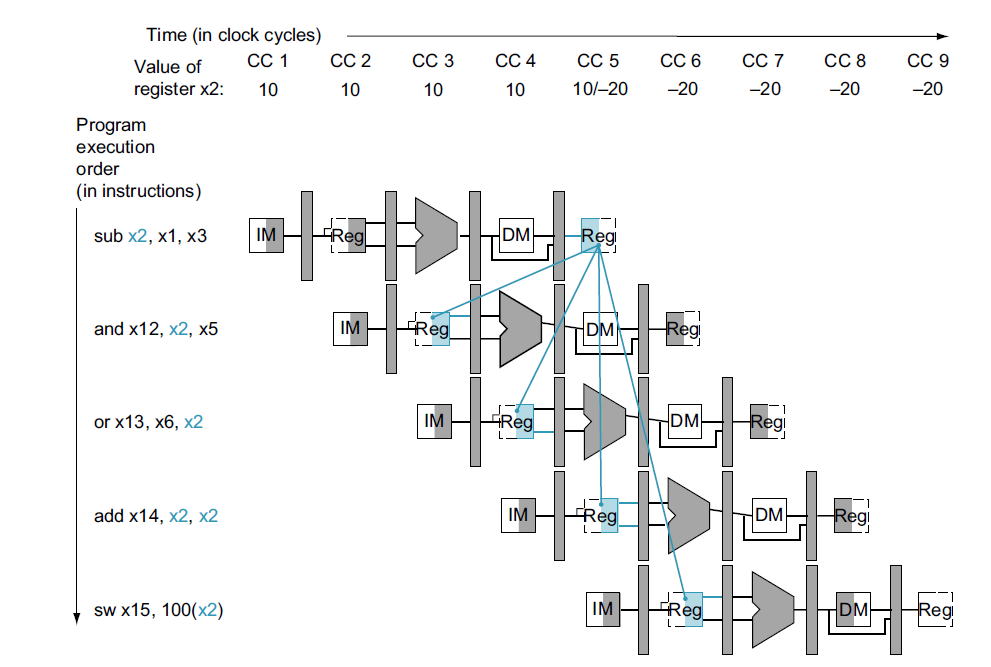
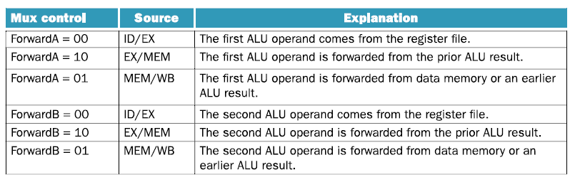
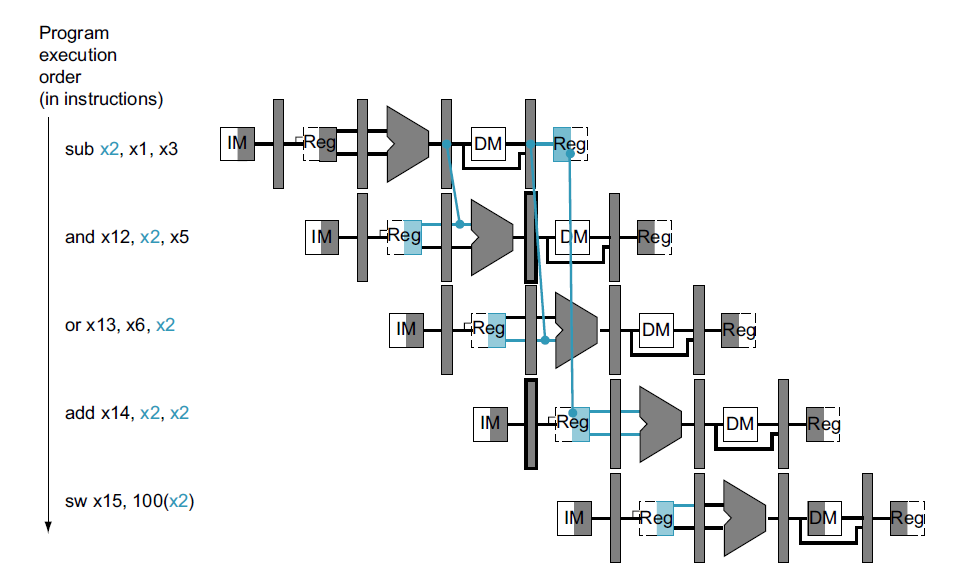
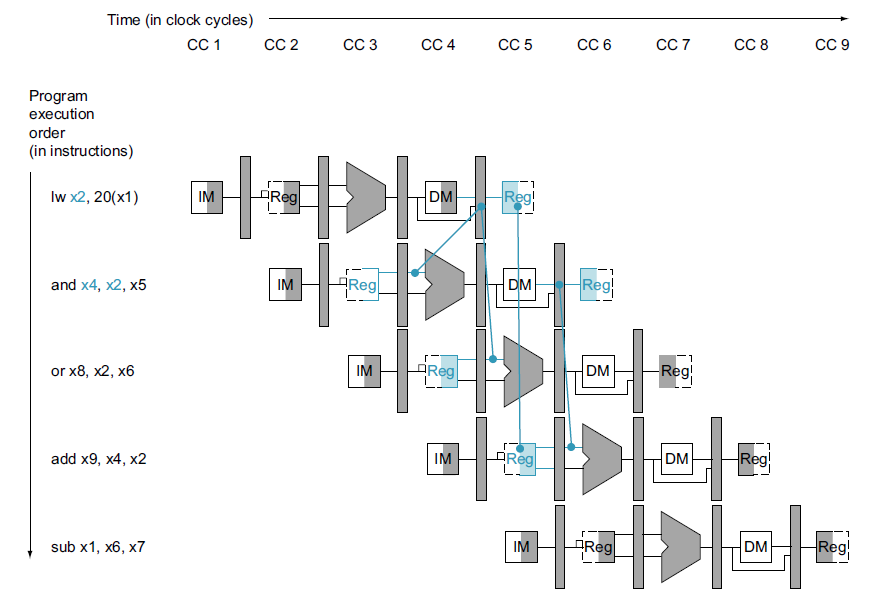
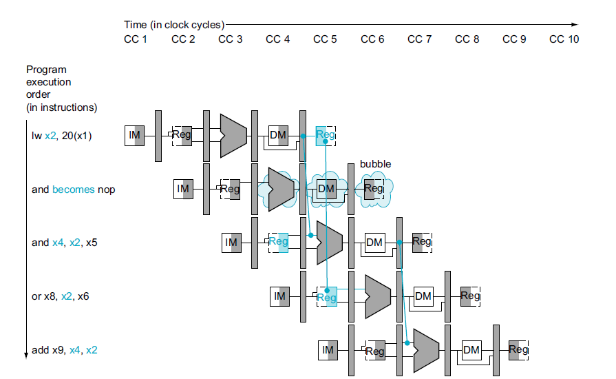
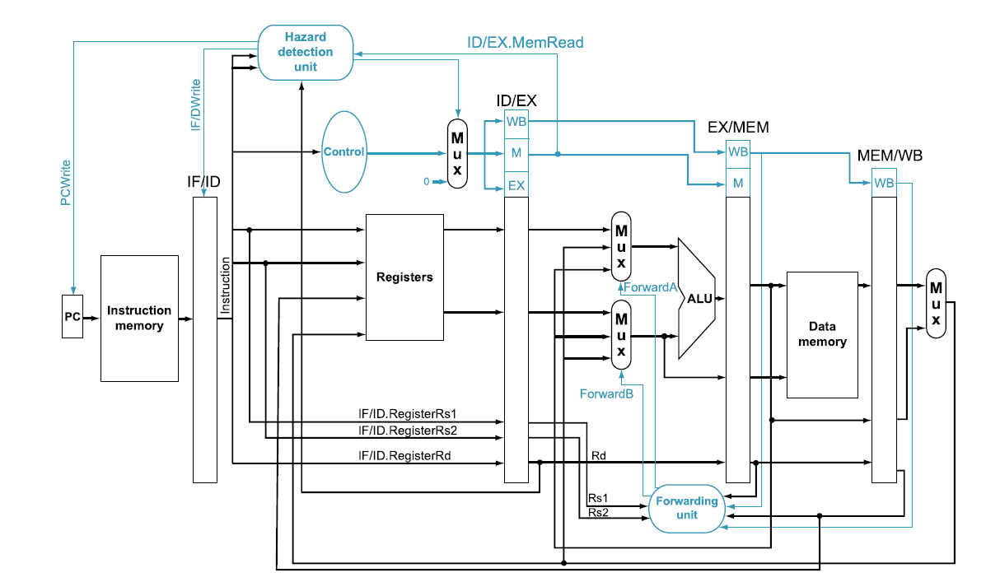
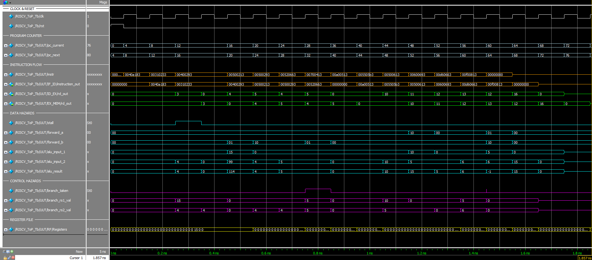

# RISC-V Pipeline Processor with Hazard Handling

## Table of Contents

- [Introduction](#introduction)
- [Project Objectives](#project-objectives)
- [Theoretical Background](#theoretical-background)
- [Data Hazards](#data-hazards)
- [Forwarding Mechanism](#forwarding-mechanism)
- [Stalling (Bubbling)](#stalling-bubbling)
- [Control Hazards](#control-hazards)
- [Control Hazard Solution](#control-hazard-solution)
- [RTL Design Challenges and Considerations](#rtl-design-challenges-and-considerations)
- [Code Structure](#code-structure)
- [Simulation and Testbench](#simulation-and-testbench)
- [Personal Reflection](#personal-reflection)
- [References](#references)
- [Author and Contact](#author-and-contact)

---

## Introduction

This project builds on a previously developed single-cycle RISC-V processor, which supported a defined subset of RV32I instructions.

**Supported instructions:**

- **R-type**: add, sub, and, or
- **I-type**: addi, lw
- **S-type**: sw
- **B-type**: beq

The move to a **5-stage pipelined architecture** offers significant performance gains through instruction-level parallelism. However, this introduces critical challenges in timing, data dependencies, and control flow that must be addressed through robust RTL design techniques.

## Project Objectives

- Understand pipeline hazards through real-world examples.
- Implement advanced hardware-level solutions in **Verilog RTL**.
- Learn and apply **hazard detection**, **forwarding**, and **flushing mechanisms**.
- Bridge theoretical computer architecture with hands-on RTL design.
- Build a robust, modular, and industry-aligned RISC-V pipeline processor.

## Theoretical Background

In pipelined architectures, instructions are executed in overlapping stages. This concurrency creates three types of hazards:

### 1. **Data Hazards**

Occurs when instructions depend on the results of previous instructions still in the pipeline.

- **RAW (Read After Write)** is the most common.

### 2. **Control Hazards**

Occurs from branch instructions whose outcome affects control flow.

### 3. **Structural Hazards**

Occurs when hardware resources are shared. Not present here due to resource replication.

**Summary Table:**

| Hazard Type | Cause                                            | Solution             |
| ----------- | ------------------------------------------------ | -------------------- |
| Data        | Instruction reads a register before it’s written | Forwarding, Stalling |
| Control     | Branch depends on result not yet available       | Flushing, Delay Slot |
| Structural  | Resource conflict                                | Resource duplication |

## Data Hazards

Consider the following example:

```assembly
sub x2, x1, x3      # x2 is written by sub
and x12, x2, x5     # x2 used as 1st operand
or  x13, x6, x2     # x2 used as 2nd operand
add x14, x2, x2     # x2 used as both operands
sw  x15, 100(x2)    # x2 used as memory base
```

All instructions depend on the result of `sub`, which is still in the pipeline. Forwarding is required to avoid incorrect execution.



## Forwarding Mechanism

Forwarding, also known as **data bypassing**, solves most data hazards by routing data directly from later pipeline stages.

**Forwarding Logic Table:**



**Example Implementation:**

```verilog
assign alu_input_1 = (forward_a == 2'b00) ? rs1_val_idex :
                     (forward_a == 2'b10) ? alu_result_exmem :
                     (forward_a == 2'b01) ? wb_data : 32'bx;
```

**Illustration of resolved forwarding:**



## Stalling (Bubbling)

Forwarding alone fails for `LW` dependencies:

```assembly
lw x2, 20(x1)       # x2 will be available only after MEM
and x4, x2, x5      # x2 needed early in EX
```

In this case, data is only available in `MEM`. Thus, we must insert a **bubble** (NOP) to delay the dependent instruction.

**Illustration of LW hazard:**



**After stalling and resolution:**



## Control Hazards

```assembly
beq x4, x5, +12
addi x8, x0, 7   # Should be flushed if branch is taken
```

Branch outcomes are known only in `EX`, so instructions fetched after must be **flushed** if mispredicted.

## Control Hazard Solution: Flushing

We compute `branch_taken` in ID using operand forwarding when needed, and **flush** IF/ID and ID/EX when required.

```verilog
assign branch_taken = Branch && (branch_rs1_val == branch_rs2_val);
if_id IF_ID(.flush(branch_taken), ...);
id_ex ID_EX(.flush(branch_taken || stall), ...);
```



**Waveform Overview:**
- `stall` is asserted for `LW` hazard
- `branch_taken` is asserted based on forwarded values



**Instruction Sequence:**

```verilog
// ==== DATA HAZARD: LW followed by dependent ADD ====
		I_Mem[4]  = 32'b00000000010000001010000110000011; // lw x3, 4(x1)      // x3 ← MEM[4]
		I_Mem[8]  = 32'b00000000001100010000001000110011; // add x4, x2, x3    // Data hazard: rs2 = x3
		I_Mem[12] = 32'b00000000010000000000001010010011; // addi x5, x0, 4    // Unrelated instruction

		// ==== CONTROL HAZARD: BEQ dependent on two immediates ====
		I_Mem[16] = 32'b00000000010100000000001000010011; // addi x4, x0, 5    // x4 ← 5
		I_Mem[20] = 32'b00000000010100000000001010010011; // addi x5, x0, 5    // x5 ← 5
		I_Mem[24] = 32'b00000000010100100000011001100011; // beq x4, x5, +12   // Should branch
		I_Mem[28] = 32'b00000000011100000000010000010011; // addi x8, x0, 7    // Skipped if branch taken
		I_Mem[32] = 32'b00000000100000000000010010010011; // addi x9, x0, 8    // Executed instead

		// ==== DATA HAZARD: ADD depends on previous ADDI values ====
		I_Mem[36] = 32'b00000000101000000000010100010011; // addi x10, x0, 10  // x10 ← 10
		I_Mem[40] = 32'b00000000010101010000010110110011; // add x11, x10, x5  // Depends on x10 and x5

		// ==== CONTROL HAZARD: BEQ comparing two immediates, no branch taken ====
		I_Mem[44] = 32'b00000000010100000000011000010011; // addi x12, x0, 5   // x12 ← 5
		I_Mem[48] = 32'b00000000011000000000011010010011; // addi x13, x0, 6   // x13 ← 6
		I_Mem[52] = 32'b00000000110101100000011001100011; // beq x12, x13, +12 // Should NOT branch
		I_Mem[56] = 32'b00000000111100000000100000010011; // addi x16, x0, 15  // Executed normally

		I_Mem[60] = 32'b00000000000000000000000000000000; // NOP
```

## RTL Design Challenges and Considerations

Throughout development several deep RTL-level challenges were encountered and addressed:

- Forwarding only from `EX/MEM` caused stale data in tight loops
- `ADDI` instructions required careful routing of `imm` into the correct MUXes
- `LW` dependencies could not be forwarded and required `stall`
- Pipeline flushing required precise ordering of control signal zeroing
- Correct handling of `x0` (always zero) was critical in forwarding logic
- Forwarding logic required bypass from ID/EX when evaluating BEQ
- Differentiation between R-type and I-type destination values in EX was needed for branch operand forwarding

Each challenge required simulation-based debugging and thoughtful design iteration.

## Code Structure

| File                            | Description                                  |
| ------------------------------- | -------------------------------------------- |
| `RISCV_Top_with_stall_registered.v` | Top-level pipeline integration with hazard handling |
| `pipeline_regs.v`               | IF/ID, ID/EX, EX/MEM, MEM/WB pipeline registers |
| `forwarding_unit.v`             | Generates forwarding control lines           |
| `hazard_detection_unit_registered.v` | Stalling logic for LW dependencies           |
| `core_modules.v`                | PC, ALU, ROM, Register File, Control Units   |

## Simulation and Testbench

To run simulation in ModelSim:

```tcl
do simulate_with_stall_registered.do
```

This script sets up the waveform viewer, loads the project, and runs the simulation.

**Register Snapshot:**

Observe the register values in the waveform or try running the instruction sequence manually:

Try it Yourself: [Cornell RISC-V Interpreter](https://www.cs.cornell.edu/courses/cs3410/2019sp/riscv/interpreter/)

## Personal Reflection

*...to be filled by author.*

## References

- Patterson & Hennessy – *Computer Organization and Design*, RISC-V Edition

## Author and Contact

This project was created and maintained by **Liron Leibovich**, a fourth-year Electrical and Computer Engineering student at **Ben-Gurion University of the Negev**.

📧 **Email**: [leibovichliron@gmail.com](mailto:leibovichliron@gmail.com)<br>
🌐 **LinkedIn**: [linkedin.com/in/lironleibovich](https://linkedin.com/in/lironleibovich)<br>
💻 **Portfolio**: [lironl99.github.io](https://lironl99.github.io/)
