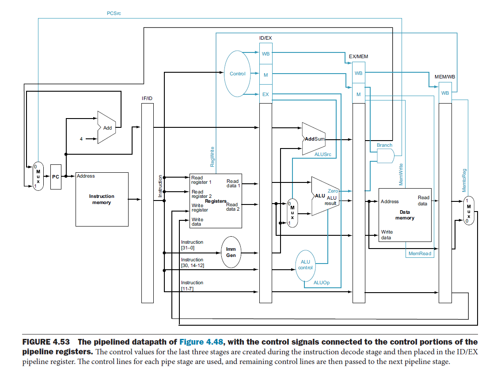
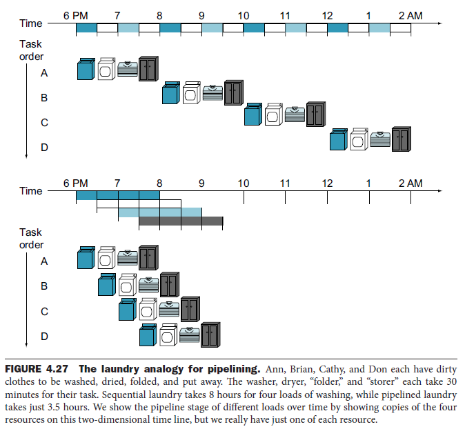
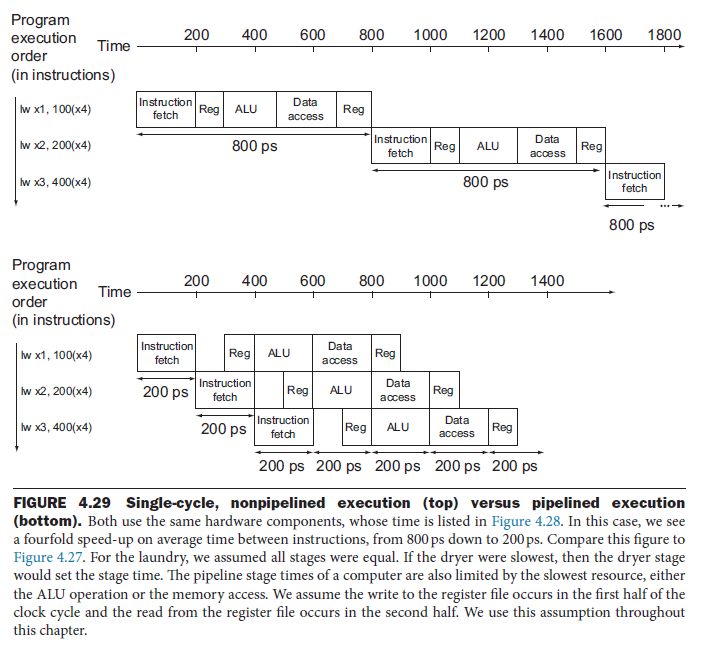
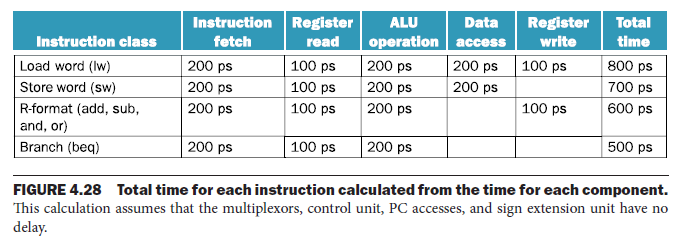
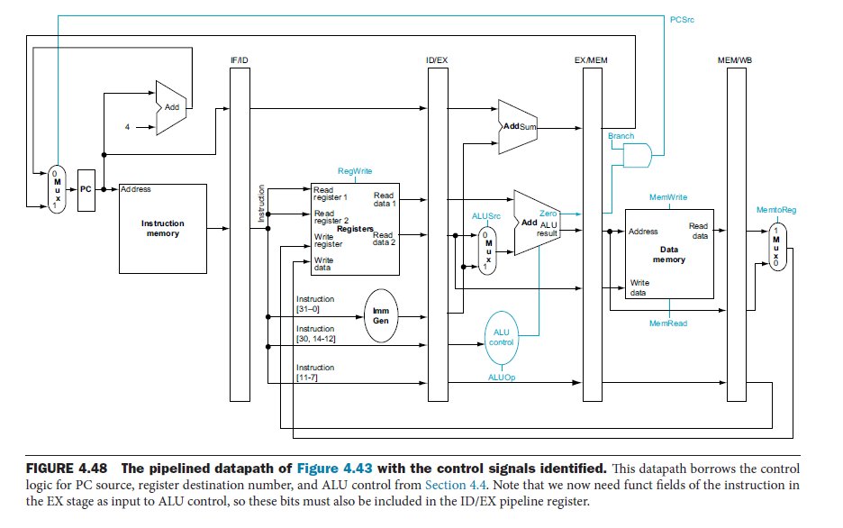
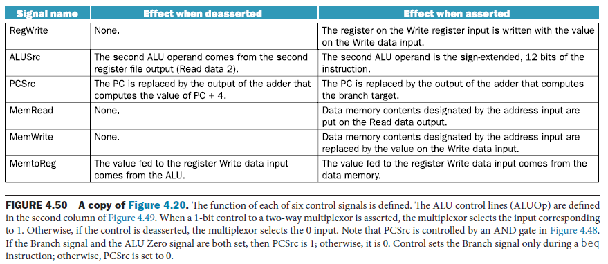
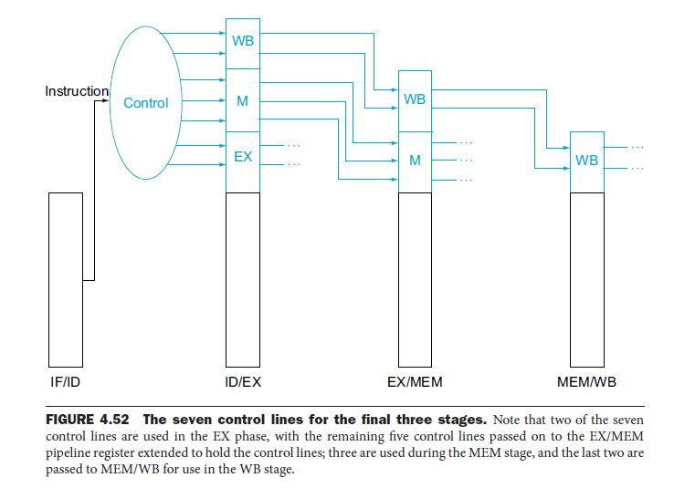
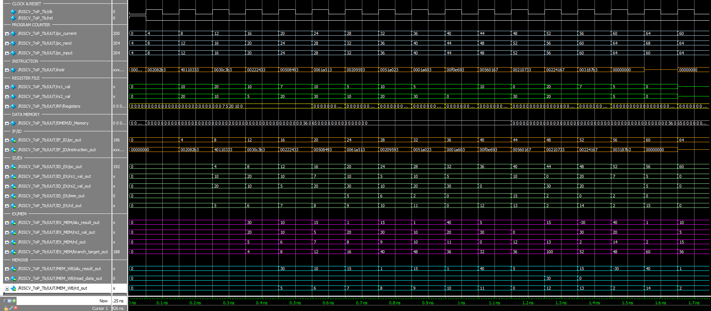
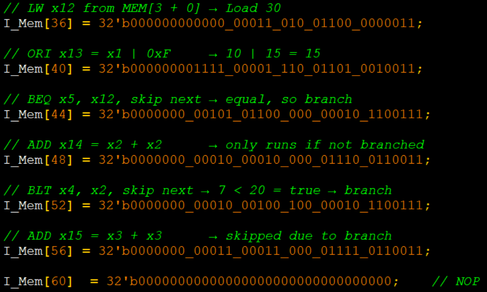

# Pipelined RISC-V CPU in Verilog
- [Previous Project - RISC-V Single Cycle CPU](https://github.com/LironL99/portfolio/tree/main/RISC-V_Single_Cycle_CPU)
## 📚 Table of Contents
1. [Project Overview](#-project-overview)
2. [Motivation & Background](#-motivation--background)
3. [Pipelined vs. Single-Cycle Execution](#-pipelined-vs-single-cycle-execution)
4. [Pipeline Design Stages](#-pipeline-design-stages)
5. [Internal Architecture & Pipeline Control](#-internal-architecture--pipeline-control)
6. [Modular RTL Implementation](#-modular-rtl-implementation)
7. [Testbench & Simulation](#-testbench--simulation)
8. [Observed Hazards During Simulation](#-observed-hazards-during-simulation)
9. [Limitations & Future Work](#-limitations--future-work)
10. [Personal Reflection](#-personal-reflection)
11. [How to Run](#-how-to-run)
12. [References](#-references)
13. [Author and Contact](#author-and-contact)

- 

---

## 📌 Project Overview
This project implements a pipelined RISC-V processor in Verilog, based on the classic five-stage instruction execution model: Fetch, Decode, Execute, Memory, Writeback. It is an upgraded version of a previously developed single-cycle CPU. The goal was to transform a sequential design into a pipelined architecture to improve instruction throughput.

The final processor design is modular, cleanly structured in separate RTL components and integrated through a top-level Verilog module. It supports a representative subset of the RISC-V RV32I instruction set and includes a simulation environment using ModelSim 10.5b with waveform inspection.

At this stage, the design does not yet include hazard detection or resolution, which are planned for a future extension.

---

## 🧠 Motivation & Background
Pipelining is a fundamental performance technique in modern CPU design that enables multiple instructions to be executed concurrently, each at a different processing stage. While a single instruction still takes five steps to complete, pipelining allows one instruction to complete every clock cycle once the pipeline is full.

This project was inspired by the conceptual and practical foundations laid out in "Computer Organization and Design – RISC-V Edition." The project closely follows the theory and figures presented in the textbook, particularly the laundry analogy, the datapath diagrams, and the pipelined control logic.

🔄 Laundry Analogy: Just as washing, drying, folding, and storing laundry can be done in parallel for different loads, pipelining overlaps the five CPU stages to increase throughput. Although the latency for a single instruction (or load of laundry) remains unchanged, pipelining dramatically improves total system throughput when many instructions are in flight.

The design also follows the principle that every piece of information required in later stages must be explicitly passed via pipeline registers, whether it's a result, an operand, or a control signal.
- 
---

## 🆚 Pipelined vs. Single-Cycle Execution

To better understand the benefits of pipelining, it helps to contrast it with a single-cycle architecture:

| Feature                     | Single-Cycle CPU                    | Pipelined CPU                             |
|----------------------------|-------------------------------------|-------------------------------------------|
| Clock Cycle Duration       | Long (must fit worst-case latency)  | Shorter (only needs to fit one stage)     |
| Throughput                 | 1 instruction per N cycles          | 1 instruction per cycle (after filling)   |
| Latency (per instruction)  | Equal to one long cycle             | Similar or slightly longer (due to overhead) |
| Hardware Utilization       | Low (one instruction uses full datapath) | High (different stages work in parallel) |
| Scalability                | Poor                                | Better suited for complex workloads       |
| Implementation Simplicity  | Simple control, easy to debug       | Requires careful data/control signal flow |

In the single-cycle implementation, every instruction takes one full clock cycle. This cycle must be long enough to accommodate the slowest instruction (e.g., lw), even if others are much faster. As a result, faster instructions waste time waiting.

By contrast, pipelining breaks the datapath into stages and uses pipeline registers to pass data and control signals forward. This means:
- The clock cycle can be shorter (only the slowest stage matters)
- Instructions overlap in execution, greatly improving instruction throughput
- However, control becomes more complex, and hazards must be addressed (in future stages)

In this project, we successfully transitioned from a single-cycle CPU to a pipelined version by introducing separation between stages, handling control signal propagation, and validating that each instruction executes correctly over time.
- 
- 

---

## 🔁 Pipeline Design Stages

The processor follows a standard five-stage pipeline:

1. IF – Instruction Fetch  
   - PC is used to read the instruction from instruction memory.  
   - The instruction and PC+4 are stored in IF/ID.  

2. ID – Instruction Decode & Register Read  
   - The instruction is decoded, source registers are read, and the immediate is sign-extended.  
   - All control signals needed for later stages are generated here and passed via ID/EX.  

3. EX – Execute / Address Calculation  
   - Performs arithmetic/logic operations or computes memory addresses using ALU.  
   - Operands and immediate are selected via control (e.g., ALUSrc).  
   - The result, along with relevant control and destination register, is passed to EX/MEM.  

4. MEM – Memory Access  
   - Executes load/store operations.  
   - Load results are read from memory and stored in MEM/WB.  
   - Store data was passed through from earlier stages.  

5. WB – Write Back  
   - ALU or memory output is written into the destination register using control signals from MEM/WB.  

Each pipeline register (e.g., IF/ID, ID/EX, EX/MEM, MEM/WB) holds:
- Instruction fields (opcode, rs1, rs2, rd)
- Immediate value (if relevant)
- Control signals (RegWrite, MemWrite, ALUSrc...)
- ALU results or memory data
- PC and PC+offset (for branches)

---

## 🧩 Internal Architecture & Pipeline Control

Each stage uses its own hardware resources to avoid structural hazards.

### Pipeline Registers & Data Propagation
- The destination register (rd) of a lw instruction is preserved from ID/EX through to MEM/WB.
- The result of an ALU operation is forwarded from EX/MEM to MEM/WB.
- Store instructions pass their rs2 value through ID and EX so it can be used during the MEM stage.

The PC acts as a special case: it is written every cycle, and can be thought of as a dedicated implicit pipeline register.

- 

### Control Signal Propagation

All control signals are generated in the ID stage and stored in pipeline registers alongside instruction data.

| Stage | Control Signals                     |
|-------|--------------------------------------|
| ID    | Control generation (for all stages) |
| EX    | ALUOp, ALUSrc                       |
| MEM   | MemWrite, MemRead, Branch           |
| WB    | RegWrite, MemToReg                  |

- 
- 

This ensures the control logic in each stage can function independently using stored signals.

---

## 🛠️ Modular RTL Implementation

The Verilog design is cleanly structured:

- `core_modules.v` — ALU, register file, immediate generator, and control logic  
- `pipeline_regs.v` — Pipeline registers (IF/ID, ID/EX, EX/MEM, MEM/WB)  
- `RISCV_Top.v` — Top-level integration module  
- `RISCV_ToP_Tb.v` — Testbench with simulation stimulus  
- `simulate.do` — Script for automated waveform simulation in ModelSim  

This modular approach mimics industry practices and allows better testing and debugging per module.

---

## 🔍 Testbench & Simulation

Simulation is performed in ModelSim using the provided simulate.do script. The testbench initializes a program in instruction memory, triggers clock cycles, and monitors:

- Register file updates  
- Pipeline register contents  
- ALU results  
- Control signal correctness  

Waveform inspection is essential for verifying that instructions flow correctly through the pipeline and that write-back occurs as expected. Each stage can be visually confirmed in the waveform window.

- 

---

## ⚠️ Observed Hazards During Simulation

### 1. Data Hazard – LW followed by BEQ

An issue was observed when executing a BEQ instruction shortly after an LW.  
The BEQ compared register x5 to x12, but the register file did not yet reflect the result of the LW to x12.  
Thus, the BEQ evaluated the old (incorrect) value of x12 and branched incorrectly.

Explanation: LW uses all 5 stages. If BEQ begins 2 cycles later, the correct value has not yet propagated to the WB stage. This is a classic **data hazard** and demonstrates the need for **forwarding or stalling logic**.

### 2. Control Hazard – BLT executes but wrong instructions follow

When a BLT instruction takes a branch, the next 1-2 instructions already in IF/ID and ID/EX continue to execute and write to the register file, even though they should have been flushed.  
This results in incorrect program behavior and shows the need for **branch flush logic**.

These issues are expected in a naive pipelined implementation and will be addressed in the next version of the CPU.

- 

---

## 🚧 Limitations & Future Work

- ❌ No forwarding or stalling for data hazards  
- ❌ No branch flushing logic for control hazards  
- ❌ No support for exceptions or memory-mapped I/O  

Planned improvements:
- ✅ Implement forwarding unit  
- ✅ Add hazard detection and stalling  
- ✅ Implement PCSrc + Flush mechanism for control hazard handling  
- ✅ Extend instruction support and add exception logic

---

## 💬 Personal Reflection

This project was an important step in bridging the gap between theory and real-world hardware implementation.  
I began by deeply studying the theoretical foundations of pipelining from Patterson & Hennessy, especially focusing on the visual and practical analogies presented.

I first revisited my single-cycle CPU implementation and gradually refactored the design into separate pipeline stages. This required restructuring modules, introducing intermediate pipeline registers, and carefully passing control and data signals forward. One of the most intellectually satisfying parts was understanding how information must flow between stages — not just results, but also context like the destination register or immediate operand.

At each stage of development, I verified functionality using waveforms in ModelSim. Seeing an instruction propagate through all five pipeline stages over time was a clear validation of the architecture I was building.

Overall, this project has solidified my understanding of pipelining, datapath separation, and RTL organization. It has also laid the groundwork for deeper explorations of hazard detection, branch handling, and performance optimization in future projects.

---

## ▶️ How to Run

1. Launch ModelSim  
2. Load all modules and the testbench  
3. Run `simulate.do` to begin simulation  
4. Inspect waveform signals for execution validation  

---

## 📚 References

- Patterson & Hennessy – *Computer Organization and Design, RISC-V Edition*, Chapters 4–5  
- RISC-V Instruction Set Manual (RV32I)

---

## Author and Contact

This project was created and maintained by **Liron Leibovich**, a fourth-year Electrical and Computer Engineering student at Ben-Gurion University of the Negev.

For questions, feedback, or collaboration opportunities, feel free to connect:

- 📧 Email: leibovichliron@gmail.com  
- 🌐 LinkedIn: [linkedin.com/in/lironleibovich](https://www.linkedin.com/in/liron-leibovich1/)
- 💻 Portfolio: [lironl99.github.io/](https://lironl99.github.io/)
