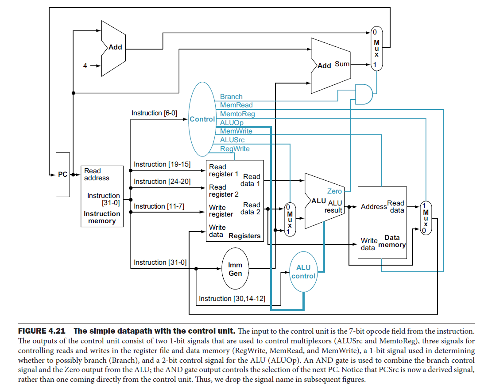
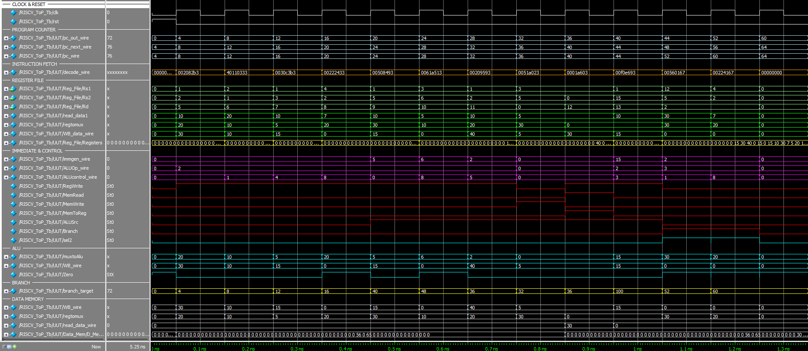

# RISC-V Single Cycle CPU Project

## Table of Contents

1. [Project Overview](#project-overview)
2. [What is RISC-V and How It Compares to CISC](#what-is-risc-v-and-how-it-compares-to-cisc)
3. [Single Cycle vs Pipelined Architecture](#single-cycle-vs-pipelined-architecture)
4. [Data Flow](#data-flow)
5. [Design Principles](#design-principles)
6. [Features and Instruction Support](#features-and-instruction-support)
7. [Module Overview](#module-overview)
   - [Program Counter (PC)](#program-counter-pc)
   - [PC Adder](#pc-adder)
   - [Instruction Memory](#instruction-memory)
   - [Register File](#register-file)
   - [Immediate Generator](#immediate-generator)
   - [Main Control Unit](#main-control-unit)
   - [ALU Control](#alu-control)
   - [ALU](#alu)
   - [Muxes](#muxes)
   - [Data Memory](#data-memory)
   - [Branch Logic](#branch-logic)
8. [Testing and Simulation](#testing-and-simulation)
9. [Waveform Analysis](#waveform-analysis)
10. [Project Build Process](#project-build-process)
11. [Personal Reflection](#personal-reflection)
12. [Project Structure](#project-structure)
13. [References](#references)
14. [Future Work](#future-work)
15. [Author and Contact](#author-and-contact)


## Project Overview

This project implements a **RISC-V Single-Cycle CPU** from scratch using Verilog. The processor supports basic arithmetic, logic, memory access, and branching instructions. The goal of this project is to simulate and analyze the behavior of a simple CPU core executing a short RISC-V instruction program.

## What is RISC-V and How It Compares to CISC

**RISC-V** is a free and open-source Instruction Set Architecture (ISA) based on the RISC (Reduced Instruction Set Computer) principles. In contrast, **CISC (Complex Instruction Set Computer)** architectures like x86 feature complex instructions that may take multiple cycles.

In this project, we chose RISC-V because it's the **modern industry standard** for instruction sets and well-suited for educational CPU designs like this one. The **single-cycle** approach emphasizes clarity while demonstrating core principles.

## Single Cycle vs Pipelined Architecture

| Feature            | Single-Cycle CPU     | Pipelined CPU          |
| ------------------ | -------------------- | ---------------------- |
| Clock Cycles/Instr | 1 (fixed)            | ~1 (on average)        |
| Performance        | Lower (longer cycle) | Higher (shorter cycle) |
| Design Complexity  | Simpler              | More complex           |

This CPU is implemented as a **single-cycle architecture** for clarity and simplicity.

## Data Flow

This section describes the step-by-step flow of data through the CPU during the execution of a single instruction.

### 🔄 Instruction Execution Steps

1. **Instruction Fetch (IF):**
   - The **Program Counter (PC)** holds the address of the current instruction.
   - The **PC Adder** calculates the next sequential address `PC + 4`.
   - The **Instruction Memory** reads the instruction located at the current PC.

2. **Instruction Decode & Register Fetch (ID):**
   - The instruction is parsed to extract control fields: `opcode`, `rs1`, `rs2`, `rd`, `funct3`, `funct7`, and `immediate`.
   - The **Register File** reads data from `rs1` and `rs2`.
   - The **Immediate Generator** computes a sign-extended immediate based on instruction type.
   - The **Main Control Unit** generates the control signals needed for the instruction.
   - The **ALU Control Unit** selects the appropriate operation for the ALU.

3. **Execution (EX):**
   - **Mux1** selects between register value and immediate as the second ALU operand.
   - The **ALU** performs the operation (e.g., ADD, SUB, SLT).
   - The **Zero flag** is set if the ALU result is zero.
   - The **Branch Adder** computes `PC + (imm << 2)` for branch target.
   - **Mux2** selects between PC+4 and the branch target based on `Branch & Zero`.

4. **Memory Access (MEM):**
   - For load/store instructions:
     - The ALU result is used as the address.
     - **Data Memory** reads or writes a 32-bit word.

5. **Write Back (WB):**
   - **Mux3** selects between ALU result and data loaded from memory.
   - The selected value is written back to register `rd`.

- 


## Design Principles

This project follows several core design principles intended to enhance learning and maintain a clear and robust architecture.

### ✅ Simplicity
- Every instruction is executed in exactly one clock cycle.
- Easy to debug and verify via waveform tracing.

### 🧱 Modularity
- Each component (ALU, Register File, Control Unit, etc.) is implemented in a self-contained Verilog module.
- This allows independent testing and better code organization.

### 🔍 Transparency
- Signals, values, and transitions are observable at every stage via ModelSim.
- Helps in understanding the internal behavior of each instruction.

### 📐 Standard Compliance
- Instruction formats strictly follow the **RISC-V base integer ISA**.
- Opcodes, funct3, and funct7 are used exactly as defined in the specification.

### 🔧 Manual Integration
- All modules are connected manually in the `RISCV_Top` module.
- Encourages hands-on learning and careful control signal routing.

These principles helped maintain both pedagogical value and correctness throughout the development of this single-cycle CPU.


## Features and Instruction Support

### Supported Instructions

- **R-type**: `add`, `sub`, `xor`, `slt`
- **I-type**: `addi`, `xori`, `slti`, `slli`, `ori`
- **S-type**: `sw`
- **L-type**: `lw`
- **B-type**: `beq`, `blt`
- **NOP**: encoded as `0x00000000`

## Module Overview

### Program Counter (PC)
- Holds address of current instruction.
- Increments by 4 each cycle unless a branch is taken.

### PC Adder
- Computes `PC + 4` to advance instruction address.

### Instruction Memory
- Stores up to 64 instructions.
- Accessed using current PC value.

### Register File
- Contains 32 registers, each 32 bits.
- Supports simultaneous reading of two registers and writing to one.

### Immediate Generator
- Extracts and sign-extends immediates for different instruction formats.

📄 *Immediate Decoding Table*:

| Type | Bit Fields                     | Expression                 |
|------|--------------------------------|----------------------------|
| I    | `instr[31:20]`                 | Sign-extend to 32 bits     |
| S    | `instr[31:25]` + `instr[11:7]` | Sign-extend                |
| B    | `instr[31], 7, 30:25, 11:8, 0` | Sign-extend + shift-left-1 |

### Main Control Unit
- Decodes opcode to generate control signals: ALUOp, Branch, MemRead, etc.

📄 *Control Signal Truth Table*:
| Input or output | Signal name | R-format | lw | sw | beq |
|-----------------|-------------|----------|----|----|-----|
| **Inputs**      | `I[6]`        | `0`        | `0`  |`0`  |`1` |
|                 | `I[5]`       | `1`        | `0` | `1`| `1` |
|                 | `I[4]`        | `1`        | `0` |`0` | `0` |
|                 | `I[3]`        | `0`        | `0`  | `0` |`0` |
|                 | `I[2]`        | `0`       | `0`  | `0` |`0`  |
|                 | `I[1]`        | `1`        | `1`  | `1` | `1` |
|                 | `I[0]`        |` 1`        | `1` | `1` |`1`  |
| **Outputs**     |`ALUSrc` | `0`        | `1` | `1` | `0` |
|                 | `MemtoReg`    | `0`        | `1` | `X` | `X` |
|                 | `RegWrite` | `1`        | `1`| `0`| `0`  |
|                 | `MemRead`  | `0`        | `1`| `0`| `0`  |
|                 | `MemWrite`  | `0`        | `0`| `1`| `0` |
|                 | `Branch` | `0`        | `0` | `0` | `1`  |
|                 | `ALUOp1` | `1`        | `0` | `0` | `0`  |
|                 | `ALUOp0`  | `0`       | `0`| `0` | `1`  |


### ALU Control
- Interprets `funct3`, `funct7`, and `ALUOp` to select operation.

📄 *ALU Operation Table*:

| ALUOp | Funct7  | Funct3 | Operation     |
|-------|---------|--------|---------------|
| `10`    | `0000000` | `000`    | ADD / ADDI    |
| `10`    | `0100000` | `000`    | SUB           |
| `10`    | `xxxxxxx` | `010`    | SLT / SLTI    |
| `10`    | `xxxxxxx` | `111`    | AND / ANDI    |
| `10`    | `xxxxxxx` | `110`    | OR / ORI      |
| `10`    | `xxxxxxx` | `100`    | XOR / XORI    |
| `10`    | `0000000` | `001`    | SLL / SLLI    |
| `10`    | `0000000`| `101`   | SRL / SRLI    |
| `10`    | `0100000` | `101`    | SRA / SRAI    |
| `11`    | `0000000` | `000`    | SUB (BEQ)     |
| `11`    | `0000000` | `100`    | SLT (BLT)     |

### ALU

- Performs all arithmetic and logic instructions.
- Provides Zero flag used in branch decisions.

### Muxes

- **Mux1**: Selects between register and immediate for ALU input B.
- **Mux2**: Selects between `PC+4` and branch target.
- **Mux3**: Chooses between ALU result and memory data for writeback.

### Data Memory

- 64-entry memory for load/store operations.
- Word-aligned, uses ALU result as address.

### Branch Logic

- Computes branch target as `PC + (imm << 2)`.
- Uses `Branch & Zero` to decide branch.


## Testing and Simulation

#### Instruction Program

```verilog
		I_Mem[0]  = 32'b00000000000000000000000000000000;    // NOP

		// ADD x5 = x1 + x2      → 10 + 20 = 30
		I_Mem[4]  = 32'b0000000_00010_00001_000_00101_0110011;

		// SUB x6 = x2 - x1      → 20 - 10 = 10
		I_Mem[8]  = 32'b0100000_00001_00010_000_00110_0110011;

		// XOR x7 = x1 ^ x3      → 10 ^ 5 = 15
		I_Mem[12] = 32'b0000000_00011_00001_100_00111_0110011;

		// SLT x8 = (x4 < x2)    → 7 < 20 = 1
		I_Mem[16] = 32'b0000000_00010_00100_010_01000_0110011;

		// ADDI x9 = x1 + 5      → 10 + 5 = 15
		I_Mem[20] = 32'b000000000101_00001_000_01001_0010011;

		// SLTI x10 = x3 < 6     → 5 < 6 = 1
		I_Mem[24] = 32'b000000000110_00011_010_01010_0010011;

		// SLLI x11 = x1 << 2    → 10 << 2 = 40
		I_Mem[28] = 32'b0000000_00010_00001_001_01011_0010011;

		// SW x5 to MEM[3 + 0]   → Store 30 at address 5
		I_Mem[32] = 32'b0000000_00101_00011_010_00000_0100011;

		// LW x12 from MEM[3 + 0] → Load 30
		I_Mem[36] = 32'b000000000000_00011_010_01100_0000011;

		// ORI x13 = x1 | 0xF     → 10 | 15 = 15
		I_Mem[40] = 32'b000000001111_00001_110_01101_0010011;

		// BEQ x5, x12, skip next → equal, so branch
		I_Mem[44] = 32'b0000000_00101_01100_000_00010_1100111;

		// ADD x14 = x2 + x2      → only runs if not branched
		I_Mem[48] = 32'b0000000_00010_00010_000_01110_0110011;

		// BLT x4, x2, skip next → 7 < 20 = true → branch
		I_Mem[52] = 32'b0000000_00010_00100_100_00010_1100111;

		// ADD x15 = x3 + x3      → skipped due to branch
		I_Mem[56] = 32'b0000000_00011_00011_000_01111_0110011;

		I_Mem[60]  = 32'b00000000000000000000000000000000;    // NOP
```

### Simulation Setup

- **Clock**: 100ns period  
- **Reset**: Asserted for first 50ns  
- **Run time**: 8000ns  
- **Simulation performed in**: ModelSim 10.5b  

### How to Exectue the simulation
1. Open directory ```RISC-V_Single_Cycle_CPU``` inside ModelSim.
2. Inside the terminal, write ```do simulate.do```. It will create the ```work``` folder, compile ```RISC-V_Single_Cycle_CPU.v``` and simulate ```RISCV_ToP_Tb```.


### Expected Waveform Snippets

- 
- 
  *Registers Content Before & After Simulation*:
- 
- 
  

## Project Build Process

1. **Theoretical Study**: Learned about RISC-V architecture and ISA design using the *Computer Organization and Design* textbook.
2. **Module Implementation**: Built all modules manually in Verilog based on dataflow diagrams.
3. **Integration**: Manually wired modules together in the `RISCV_Top` module.
4. **Instruction Testing**: Wrote a test program to verify arithmetic, logic, memory, and branch functionality.
5. **Waveform Analysis**: Used ModelSim to trace signal correctness with `simulate.do` and waveform display.

## Personal Reflection

I completed this project while enrolled in the course *"Central Processing Unit Architecture - Theory"* by Dr. Guy Tel-Zur, which teaches ISA design with MIPS for instructional clarity. I decided to go a step further and implement a RISC-V processor, as it's more relevant for industry.

Although real-world RISC-V CPUs are pipelined, this single-cycle model served as an excellent foundation. The main challenge was learning both theory and implementation simultaneously. Progress was slow initially but accelerated as confidence grew.

I coded each module from scratch, gradually using ChatGPT to assist with code generation and debugging. Catching and fixing errors strengthened my understanding. All integration and signal connections were done manually based on architecture diagrams.

Overall, this project was both educational and enjoyable, and I see it as a strong basis for more advanced future projects.

## Project Structure
```structure
RISC-V_Single_Cycle_CPU/
├── RISC-V_Single_Cycle_CPU.v         # Full CPU implementation
├── RISCV_ToP_Tb.v         # Testbench
├── simulate.do            # Simulation waveform script
├── waveform.vcd           # Generated waveform
├── pictures/              
├── Computer_Organization_And_Design_RISC-V Edition_Morgan_Kaufmann.pdf
```

## References

- **Computer Organization And Design: RISC-V Edition** — Morgan Kaufmann.
- **Central Processing Unit Architecture - Theory** — Dr. Guy Tel-Zur, Ben-Gurion University

## Future Work

- Support for additional instructions
- MIPS or RISC-V pipeline extension
- Hazard detection and forwarding
- Full assembler + memory file loader

## Author and Contact

This project was created and maintained by **Liron Leibovich**, a fourth-year Electrical and Computer Engineering student at Ben-Gurion University of the Negev.

For questions, feedback, or collaboration opportunities, feel free to connect:

- 📧 Email: lironleibovich@gmail.com  
- 🌐 LinkedIn: [linkedin.com/in/lironleibovich](https://www.linkedin.com/in/liron-leibovich1/)
- 💻 Portfolio: [lironl99.github.io/](https://lironl99.github.io/)
