# STA Hands-On Project: From Baseline Constraints to Timing Closure

## Table of Contents

- [Introduction](#introduction)
- [Project Objectives](#project-objectives)
- [Theoretical Background](#theoretical-background)
- [Stage-by-Stage Process](#stage-by-stage-process)
- [Quantitative Improvement Summary](#quantitative-improvement-summary)
- [Technical Lessons Learned](#technical-lessons-learned)
- [Code & Constraints Structure](#code-&-constraints-structure)
- [Simulation and Reports](#simulation-and-reports)
- [Personal Reflection](#personal-reflection)
- [References](#references)
- [Author and Contact](#author-and-contact)

---

## Introduction

This project was designed to simulate a realistic Static Timing Analysis (STA) workflow using **Intel Quartus Prime 18.1** and the **TimeQuest Timing Analyzer**. The aim was to:
- Build a solid baseline with correct SDC constraints.
- Verify timing report validity.
- Introduce realistic and synthetic critical paths.
- Correctly constrain synthetic paths to focus on functional timing.
- Apply design-level optimizations (RTL pipelining) to achieve timing closure.

The process mirrors professional STA tasks in industry — from constraints definition, through path analysis and exception handling, to design optimization for timing.

## Project Objectives

- Establish correct SDC constraints and confirm baseline timing.
- Add a real multiply-based critical path to create setup violations.
- Create a synthetic false path to simulate irrelevant slow logic.
- Apply targeted `set_false_path` constraints to exclude synthetic paths.
- Optimize the real path via RTL pipelining to close timing at 100 MHz.
- Keep hold timing clean across all stages.

## Theoretical Background

Static Timing Analysis (STA) is a method to verify the timing performance of a circuit without requiring input vectors. Instead, it checks all possible paths for setup and hold time compliance based on defined clock constraints.

**Core Concepts in STA:**
- **Setup Slack (WNS)**: How much earlier data arrives before the setup deadline.
- **Hold Slack (WHS)**: How much later data arrives after the hold time.
- **False Path**: A path that exists but is not functionally relevant in real operation.
- **Clock Uncertainty**: Margin to account for jitter and skew.
- **Pipelining**: Splitting long combinational logic into multiple stages to improve Fmax.

## Stage-by-Stage Process

Stage 1 — Clock Target, SDC Setup, and Baseline Timing
Goal
Establish a realistic timing target and correct SDC constraints so TimeQuest can generate accurate, meaningful timing reports before introducing the ALU multiply path.

Step 1 — Project and SDC Setup
What I Did
Created a Quartus project (STA_HandsOn.qpf / STA_HandsOn.qsf) targeting a Cyclone V device.
Defined a 100 MHz primary clock (10.000 ns period) on the top-level clk port:
create_clock -name clk_main -period 10.000 [get_ports clk]
Added clock uncertainty to model jitter and margin conservatively, applied explicitly within the same clock domain:
set_clock_uncertainty -setup 0.20 -from [get_clocks clk_main] -to [get_clocks clk_main]
set_clock_uncertainty -hold 0.05 -from [get_clocks clk_main] -to [get_clocks clk_main]
Marked asynchronous reset as a false path:
set_false_path -from [get_ports reset_n]
Left I/O delay constraints commented out for now (focus is internal reg-to-reg timing).
Artifacts
src/top.v — Minimal top-level module with a preserved reg-to-reg path (r0 → r1), comments in English only.
constraints/top.sdc — Base clock definition, uncertainty, and false-path definition.
STA_HandsOn.qpf / STA_HandsOn.qsf — Project and settings file pointing to the correct top entity and SDC.
Rationale
100 MHz is challenging enough for a multiply path while still reachable after optimizations.
A small, realistic clock uncertainty avoids over-optimistic slack.
Marking async reset as a false-path keeps timing reports focused on meaningful synchronous paths.

Step 1.a — Initial Compile and “No Paths” Issue
Problem
When running:
report_timing -setup -from [get_clocks clk_main] -to [get_clocks clk_main] ...
report_timing -hold -from [get_clocks clk_main] -to [get_clocks clk_main] ...
TimeQuest reported:
Report Timing: No setup paths were found
Report Timing: No hold paths were found
This indicated no preserved reg-to-reg paths after synthesis/Fitter.
Root Cause
The r0 → r1 path had no observable fanout at the top level, so synthesis pruned it.
Fix
Added a top-level output dout driven by r1.
Kept both r0 and r1 with (* preserve *) and /* synthesis preserve */ attributes to ensure the path is retained.
Recompiled the project and updated the timing netlist in TimeQuest.
Updated top.v:
module top (
input wire clk,
input wire reset_n,
output wire [31:0] dout
);
(* preserve *) reg [31:0] r0 /* synthesis preserve */;
(* preserve *) reg [31:0] r1 /* synthesis preserve */;

always @(posedge clk or negedge reset_n) begin
if (!reset_n) begin
r0 <= 32'd0;
r1 <= 32'd0;
end else begin
r0 <= r0 + 32'd1;
r1 <= r0;
end
end

assign dout = r1;
endmodule

Step 1.b — Baseline Timing Reports
Software Steps
Opened the project:
Verified Top-level entity is top (Assignments → Settings → General).
Verified SDC file points to constraints/top.sdc (Assignments → Settings → TimeQuest Timing Analyzer → SDC files).
Compile:
Ran full Compile (including Fitter).
TimeQuest reports:
Ran:
report_timing -setup -from [get_clocks clk_main] -to [get_clocks clk_main] -npaths 5 -detail full_path
report_timing -hold -from [get_clocks clk_main] -to [get_clocks clk_main] -npaths 5 -detail full_path
Confirmed 5 setup and 5 hold paths within clk_main domain.
Baseline Results
Worst Setup Slack (WNS): 6.366 ns
Worst Hold Slack (WHS): 0.360 ns
No setup or hold violations.
Screenshots captured:
Report Clocks showing clk_main @ 10.000 ns.

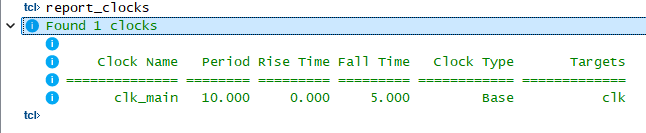
Worst-Case Paths (Setup) full path details.
Worst-Case Paths (Hold) full path details.

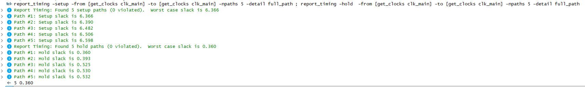

Stage 1 Status
✅ SDC is valid and applied to the intended domain. ✅ Baseline timing exists for both setup and hold paths. ✅ Async reset is excluded from timing. ✅ Slack values recorded for future comparison.

Stage 2 — Introducing Critical Paths, Observing and Constraining False Paths
Goal
Add a genuine multiply-based critical path to create real setup violations and introduce a synthetic “slow” path designed to be a false-path candidate. First, observe both in timing reports, then apply a targeted set_false_path to remove the synthetic path from analysis so WNS reflects only the real functional path.

Step 2.a — Project Update with Heavy and Synthetic Paths
What I Did
Added alu_mul_chain.v implementing y = (a * b) * c (two sequential multiplications) with a registered output to serve as the real heavy path.
Added false_path_chain.v implementing a triple-multiply “slow” chain (slow1, slow2, slow3) hidden behind a mux. Initially, the mux select (sel) was a live toggle (dbg_sel) so STA would include both arcs and the slow path could become WNS.
Updated top.v to:
Generate changing operands via counters (cnt_a, cnt_b, cnt_c).
Instantiate both the real heavy path (u_real) and the synthetic slow chain (u_slow).
Combine results into a preserved output register r_out to keep both paths in the netlist.
Left constraints/top.sdc unchanged from Stage 1 (clock definition, uncertainties, reset false-path). No false-path constraints yet for the synthetic chain.
Artifacts
src/alu_mul_chain.v — two-stage multiply path, registered output.
src/false_path_chain.v — triple-multiply behind mux, slow nets preserved.
Updated src/top.v — integrates both paths with dbg_sel toggling to activate both mux arcs.
constraints/top.sdc — unchanged from Stage 1 for this sub-step.
Rationale
The real heavy path produces functional setup violations to work on in later stages.
The synthetic chain simulates a design-irrelevant path that can be cleanly excluded with a false-path constraint.

Step 2.a — Initial Results with Synthetic Path Active
Software Steps
Opened STA_HandsOn_Stage2.qpf in Quartus.
Verified Top-level entity is top and SDC file is constraints/top.sdc.
Ran full Compile (including Fitter).
In TimeQuest, ran:
report_timing -setup -from [get_clocks clk_main] -to [get_clocks clk_main] -npaths 5 -detail full_path
report_timing -hold -from [get_clocks clk_main] -to [get_clocks clk_main] -npaths 5 -detail full_path
Observed:
WNS (Setup) ≈ –1.864 ns, all top 5 worst setup paths through false_path_chain:u_slow (synthetic chain).
WHS (Hold) ≈ 0.347 ns, no hold violations.
Baseline Results before Constraint
Worst Setup Slack: –1.864 ns (synthetic path).

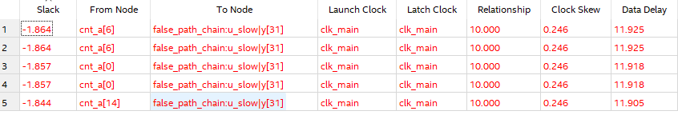
Worst Hold Slack: 0.347 ns.

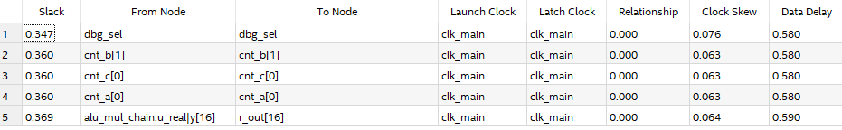
Top violating paths: cnt_a[...] → false_path_chain:u_slow|y[...].

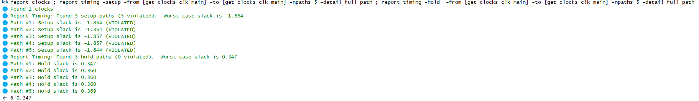

Step 2.b — Applying a Targeted False-Path
What I Did
Added a targeted set_false_path to constraints/top.sdc:
set_false_path \
-from [get_registers "*cnt_*"] \
-to [get_registers "false_path_chain:u_slow|y[*]"]
This excludes only paths from the operand counters into the y[*] register inside u_slow.
Reloaded constraints and updated the timing netlist in TimeQuest:
read_sdc constraints/top.sdc
update_timing_netlist
report_exceptions
Verified:
report_exceptions listed the new false-path as “complete (not overridden)”.
report_timing -setup -from [get_registers "*cnt_*"] -to [get_registers "false_path_chain:u_slow|y[*]"] returned “No paths were found” (or only non-violating paths).
The synthetic path no longer contributed to WNS; worst setup paths now come from the real alu_mul_chain.
Artifacts
Updated constraints/top.sdc with targeted set_false_path.
Rationale
Keeps timing reports focused on functional paths.
Avoids over-constraining unrelated paths (false-path is scoped to specific startpoints and endpoints).

Step 2.b — Results after Constraint
Software Steps
Ran:
report_timing -setup -from [get_clocks clk_main] -to [get_clocks clk_main] -npaths 5 -detail full_path
report_timing -hold -from [get_clocks clk_main] -to [get_clocks clk_main] -npaths 5 -detail full_path
Observed:
WNS (Setup) ≈ –0.422 ns — all worst paths now through alu_mul_chain:u_real (real multiply path).
WHS (Hold) ≈ 0.347 ns — still no hold violations.
Baseline Results after Constraint
Worst Setup Slack: –0.422 ns (real path).
Worst Hold Slack: 0.347 ns.
Synthetic chain no longer appears in worst-path setup list.
Screenshots captured
report_exceptions with the targeted false-path listed.

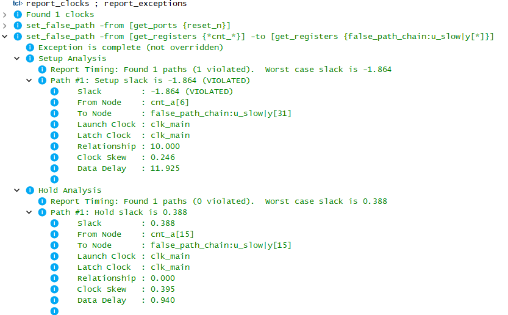
Worst-Case Paths (Setup) showing only real path violations.
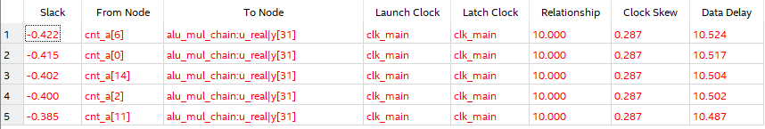
Worst-Case Paths (Hold) showing no violations.

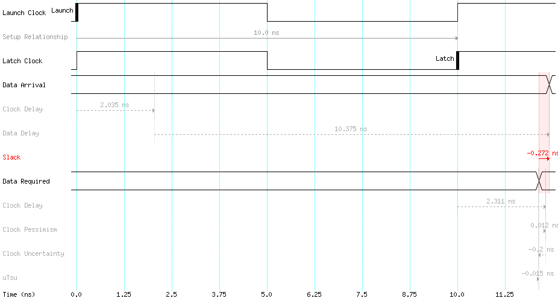

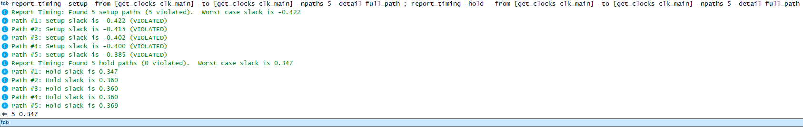

Stage 2 Status
✅ Synthetic slow path created and verified as WNS before constraint. ✅ Targeted false-path applied and verified effective. ✅ WNS now reflects the real functional path in alu_mul_chain. ✅ Hold timing remains clean.

Stage 3 — RTL Pipelining of the Real Multiply Path
Goal
Reduce percycle combinational delay on the functional critical path so setup slack becomes positive at 100 MHz, without relying on physical flow tricks.

What I Did
Rewrote src/alu_mul_chain.v as a 3stage pipeline to split the backtoback multiplies across cycles:
S1: m1_r <= a * b
S2: m2_r <= m1_r * c_r (with c_r to timealign c)
S3: y <= m2_r
Left src/top.v, src/false_path_chain.v, and constraints/top.sdc unchanged. The targeted set_false_path from Stage 2.b remains in place (excludes nonfunctional paths into false_path_chain:u_slow|y[*]).
Artifacts
src/alu_mul_chain.v — pipelined version (3cycle latency).
No SDC changes in this stage.
Rationale
One multiplier per stage dramatically shortens the cycle’s data delay, turning WNS positive with a small RTLonly change.
Latency of y increases (1 → 3 cycles), which is acceptable for this exercise and typical in highspeed designs.

Software Steps
Recompiled the project (Analysis & Synthesis + Fitter).
In TimeQuest, ran:
report_clocks
report_exceptions
report_timing -setup -from [get_clocks clk_main] -to [get_clocks clk_main] -npaths 5 -detail full_path
report_timing -hold -from [get_clocks clk_main] -to [get_clocks clk_main] -npaths 5 -detail full_path

Results
Worst Setup Slack (WNS): +3.709 ns (all top 5 setup paths are clean).
Worst Hold Slack (WHS): +0.360 ns (no hold violations).
Top setup paths terminate inside alu_mul_chain:u_real stage registers (e.g., m1_r[*], m2_r[*]), confirming the pipeline is effective.

Screenshots captured
WorstCase Paths (Setup) after pipelining: 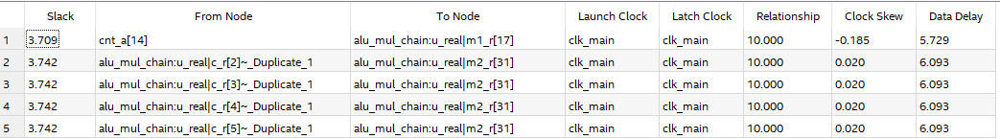

WorstCase Paths (Hold): 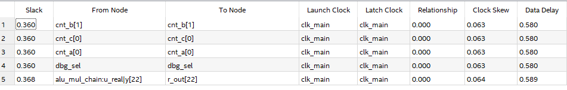

Clocks & exceptions summary: 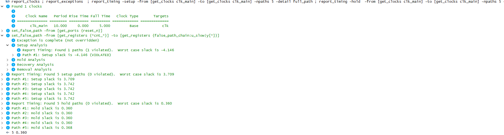

Positiveslack waveform (setup): 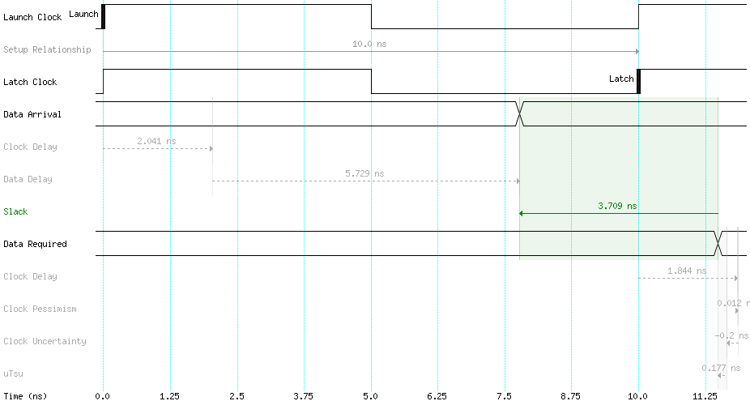 ✅

Stage 3 Status
✅ Pipelined the real path; setup slack is comfortably positive at 100 MHz. ✅ Hold timing remains clean. ✅ The Stage 2.b falsepath remains active, keeping reports focused on functional paths.

Project Summary — STA Hands-On (Stages 1–3)
Project Context & Goals
This project was designed to simulate a realistic Static Timing Analysis (STA) workflow using Intel Quartus Prime 18.1 and the TimeQuest Timing Analyzer. The goal was to:
Build a solid baseline with correct SDC constraints and verify the validity of timing reports.
Introduce both realistic and synthetic critical paths, then correctly constrain the synthetic path to focus on functional timing.
Apply a design-level optimization (RTL pipelining) to the real critical path to achieve timing closure at the target clock frequency (100 MHz).
The process mirrors professional STA tasks in industry — from constraints definition, through path analysis and exception handling, to design optimization for timing.

Tools & Methods
Quartus Prime 18.1 — synthesis, placement, and routing.
TimeQuest Timing Analyzer — STA reports, WNS/WHS tracking, path tracing, and constraint validation.
SDC (Synopsys Design Constraints) — for clock definition, uncertainty modeling, and path exceptions.
Custom RTL modules in Verilog — including an ALU multiply chain (alu_mul_chain) and a synthetic slow chain (false_path_chain).
Analysis was done in three iterative stages, each building on the previous one.

Stage-by-Stage Process & Results
Stage 1 — Baseline Constraints and Timing Validation
Defined clk_main at 100 MHz with realistic clock uncertainty.
Excluded asynchronous reset from timing analysis using a targeted set_false_path.
Ensured a simple register-to-register path was preserved for initial measurement.
Results:
WNS: +6.366 ns
WHS: +0.360 ns
All setup and hold paths clean — confirms constraints are correct and timing reports are valid.

Stage 2 — Critical Path Creation & False Path Exclusion
2a — Adding the Paths
Added alu_mul_chain — a realistic critical path with two cascaded multiplications.
Added false_path_chain — a synthetic slow path with three multiplications behind a debug MUX.
Initial Result:
WNS: –1.864 ns (dominated by the synthetic path)
WHS: +0.347 ns
2b — Applying the Exception
Used a specific set_false_path to exclude only the non-functional synthetic chain.
Real path now dominates STA.
Result after constraint:
WNS: –0.422 ns (real path)
WHS: +0.347 ns
This stage demonstrated that without correct path exceptions, non-functional logic can distort STA results and waste optimization effort.

Stage 3 — RTL Pipelining for Timing Closure
Rewrote alu_mul_chain into a 3-stage pipeline:
S1: m1_r <= a * b
S2: m2_r <= m1_r * c_r (with c_r to align c)
S3: y <= m2_r
Each stage contains only one multiplier, reducing per-cycle delay and increasing achievable Fmax.
No SDC changes; Stage 2 false path remained valid.
Results:
WNS: +3.709 ns (all top setup paths clean)
WHS: +0.360 ns
Timing closure achieved at 100 MHz without relying on synthesis/fitter effort changes.

Quantitative Improvement Summary
Net WNS improvement from Stage 2b → Stage 3: +4.131 ns Overall change Stage 2a → Stage 3: ~+5.573 ns

Technical Lessons Learned
Accurate clock and exception constraints are essential to ensure STA focuses on real timing bottlenecks.
False paths should be scoped precisely to avoid unintentionally excluding valid paths.
RTL-level pipelining remains one of the most effective methods to solve setup violations without tool-specific tricks.
Always validate that hold timing remains safe after setup optimizations.
Recovery/Removal checks on asynchronous resets can be excluded from setup/hold analysis when not relevant to functional timing.

Final Status
✅ Timing closure achieved at 100 MHz. ✅ Real critical path optimized via pipelining. ✅ Synthetic false path excluded without affecting functional analysis. ✅ All setup and hold slacks positive. ✅ Documentation includes constraints, RTL changes, STA reports, and waveforms.

## Quantitative Improvement Summary

| Stage   | WNS (ns) | WHS (ns) | Dominant Path Before Fix |

| ------- | -------- | -------- | ------------------------ |

| Stage 1 | +6.366   | +0.360   | Simple preserved reg path |

| Stage 2a| –1.864   | +0.347   | Synthetic slow path       |

| Stage 2b| –0.422   | +0.347   | Real multiply chain       |

| Stage 3 | +3.709   | +0.360   | — (timing closed)         |

## Technical Lessons Learned

- Accurate clock and exception constraints are essential.
- Scope false paths precisely to avoid excluding valid paths.
- RTL pipelining is an effective fix for setup violations without tool-specific tricks.
- Always validate hold timing after setup optimizations.
- Asynchronous resets can be excluded from setup/hold checks if not relevant.

## Code & Constraints Structure

| File | Description |

| ---- | ----------- |

| `src/top.v` | Top-level module integrating paths |

| `src/alu_mul_chain.v` | Multiply-based critical path implementation |

| `src/false_path_chain.v` | Synthetic triple-multiply slow path |

| `constraints/top.sdc` | Clock, uncertainty, false-path constraints |

## Simulation and Reports

All timing analyses were run in **Quartus Prime 18.1** using **TimeQuest**. The project includes detailed timing reports, exceptions, and waveforms for each stage, stored in the `pictures/` directory.

## Personal Reflection

Through this project, I experienced the complete STA process in a controlled but realistic environment. I saw firsthand how constraints, exceptions, and RTL design decisions impact timing results. Pipelining provided a tangible improvement in WNS, and handling false paths kept the focus on functional performance. These lessons translate directly into best practices for real-world chip design workflows.

## References

- Synopsys Design Constraints (SDC) User Guide

- Intel Quartus Prime & TimeQuest Timing Analyzer Documentation

## Author and Contact

**Liron Leibovich** — Fourth-year Electrical and Computer Engineering student at **Ben-Gurion University of the Negev**.

📧 **Email**: [leibovichliron@gmail.com](mailto:leibovichliron@gmail.com)  

🌐 **LinkedIn**: [linkedin.com/in/lironleibovich](https://www.linkedin.com/in/liron-leibovich1/)  

💻 **Portfolio**: [lironl99.github.io](https://lironl99.github.io/)
