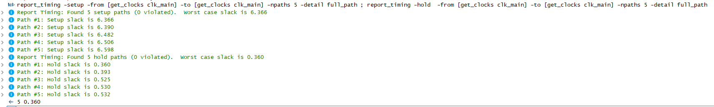

# Static Timing Analysis Hands-On Project

## Table of Contents
- [Introduction](#introduction)
- [Project Objectives](#project-objectives)
- [Stage 1 - Baseline Constraints and Timing Validation](#stage-1--baseline-constraints-and-timing-validation)
- [Stage 2 - Critical Path Creation and False Path Exclusion](#stage-2--critical-path-creation-and-false-path-exclusion)
- [Stage 3 - RTL Pipelining for Timing Closure](#stage-3--rtl-pipelining-for-timing-closure)
- [Quantitative Improvement Summary](#quantitative-improvement-summary)
- [Key Technical Lessons](#key-technical-lessons)
- [Conclusion](#conclusion)

## Introduction
This document summarizes a practical hands-on project in **Static Timing Analysis (STA)** using Intel Quartus Prime 18.1 and the TimeQuest Timing Analyzer.  
The project simulates a realistic STA workflow that chip designers and physical design engineers face in industry: writing constraints, analyzing reports, applying exceptions, and performing RTL optimizations to achieve timing closure.

## Project Objectives
1. Define correct **SDC constraints** and validate baseline timing.  
2. Introduce both **real** and **synthetic critical paths**, then constrain the false path.  
3. Optimize the real path with **RTL pipelining** to achieve timing closure at the target frequency (**100 MHz**).

---

## Stage 1 - Baseline Constraints and Timing Validation

### Goal
Establish a valid STA environment with correct constraints and confirm that timing reports are meaningful.

### What I Did
- Defined `clk_main` at **100 MHz** with clock uncertainty.  
- Excluded asynchronous reset from analysis using `set_false_path`.  
- Preserved a simple register-to-register path for timing measurement.

### Example Constraints
```tcl
create_clock -name clk_main -period 10.000 [get_ports clk]
set_clock_uncertainty -setup 0.20 -from [get_clocks clk_main] -to [get_clocks clk_main]
set_clock_uncertainty -hold 0.05 -from [get_clocks clk_main] -to [get_clocks clk_main]
set_false_path -from [get_ports reset_n]
```

### Results
- **Worst Setup Slack (WNS):** +6.366 ns  
- **Worst Hold Slack (WHS):** +0.360 ns  
- No setup/hold violations.

  

---

## Stage 2 - Critical Path Creation and False Path Exclusion

### Goal
Add both a real critical path and a synthetic false path, then exclude the false path to focus STA on functional timing.

### What I Did
- Added `alu_mul_chain` (two multiplies) as the **real critical path**.  
- Added `false_path_chain` (three multiplies, non-functional) as a **synthetic path**.  
- Verified that before constraints, the false path dominated WNS.  
- Applied a **targeted `set_false_path`** to exclude only the non-functional chain.

### Example RTL Snippet (False Path)
```verilog
always @(posedge clk) begin
    if (!reset_n)
        y <= 0;
    else
        y <= (sel) ? a * b * c : a * b; // synthetic long path vs real path
end
```

### Results Before Constraint
- **WNS:** –1.864 ns (dominated by synthetic path)  
- **WHS:** +0.347 ns  

  


### Results After Constraint
- **WNS:** –0.422 ns (real path dominates)  
- **WHS:** +0.347 ns  

  


---

## Stage 3 - RTL Pipelining for Timing Closure

### Goal
Reduce per-cycle combinational delay on the real path using RTL pipelining.

### What I Did
- Rewrote `alu_mul_chain` into a **3-stage pipeline**:
  - **S1:** `m1_r <= a * b`
  - **S2:** `m2_r <= m1_r * c_r`
  - **S3:** `y <= m2_r`
- No SDC changes were required.

### Example RTL Snippet (Pipelined Multiply Chain)
```verilog
always @(posedge clk or negedge reset_n) begin
    if (!reset_n) begin
        m1_r <= 0;
        m2_r <= 0;
        y    <= 0;
        c_r  <= 0;
    end else begin
        m1_r <= a * b;
        c_r  <= c;
        m2_r <= m1_r * c_r;
        y    <= m2_r;
    end
end
```

### Results
- **WNS:** +3.709 ns (all setup paths clean)  
- **WHS:** +0.360 ns (no hold violations)  

  
  


---

## Quantitative Improvement Summary

| Stage   | WNS (ns) | WHS (ns) | Dominant Path Before Fix |
| ------- | -------- | -------- | ------------------------ |
| Stage 1 | +6.366   | +0.360   | Simple reg-to-reg        |
| Stage 2a| –1.864   | +0.347   | Synthetic slow path      |
| Stage 2b| –0.422   | +0.347   | Real multiply chain      |
| Stage 3 | +3.709   | +0.360   | Timing closed            |

---

## Key Technical Lessons

- Accurate **SDC constraints** are the foundation of meaningful STA.  
- **False paths** must be scoped narrowly to avoid excluding real logic.  
- **RTL pipelining** is a simple but powerful optimization to fix setup violations.  
- Hold checks must always be re-verified after setup improvements.  
- Asynchronous reset checks (Recovery/Removal) can be excluded if not relevant.

---

## Conclusion  

This project provided a complete hands-on flow of **Static Timing Analysis (STA)**, progressing step by step from baseline constraint definition to achieving final timing closure.  

- In **Stage 1**, I validated the timing environment by defining proper clocks, uncertainties, and basic false paths, ensuring that reports were trustworthy.  
- In **Stage 2**, I created both a synthetic long path and a real multiply-based critical path. By constraining the false path correctly, I shifted the analysis focus onto the true logic.  
- In **Stage 3**, I solved the real setup violation using **RTL pipelining**, which improved the Worst Negative Slack (WNS) from **–0.422 ns** to **+3.709 ns**, while preserving hold margins.  

At the target frequency of **100 MHz**, the design now meets timing with **WNS = +3.709 ns** and **WHS = +0.360 ns**, demonstrating a clean closure.  

### Key Takeaways  
- Writing **accurate SDC constraints** is not a clerical task - it defines the scope of the entire STA analysis.  
- **False path handling** showed me the importance of precision: being too broad can hide real problems, while being too narrow can generate unnecessary violations.  
- **RTL-level optimization (pipelining)** is often the simplest and most effective way to improve slack without relying on tool tricks.  

### Personal Reflection  
This project not only improved my confidence with **Quartus & TimeQuest**, but also gave me practical insights into the **timing closure loop** that real chip design teams face. I now better understand how constraints, reports, and RTL modifications interact.  

For me as an aspiring **Chip Design / Physical Design Engineer**, this experience simulates the mindset required in industry: start from correct constraints, analyze carefully, and fix violations with minimal yet effective design changes.  
